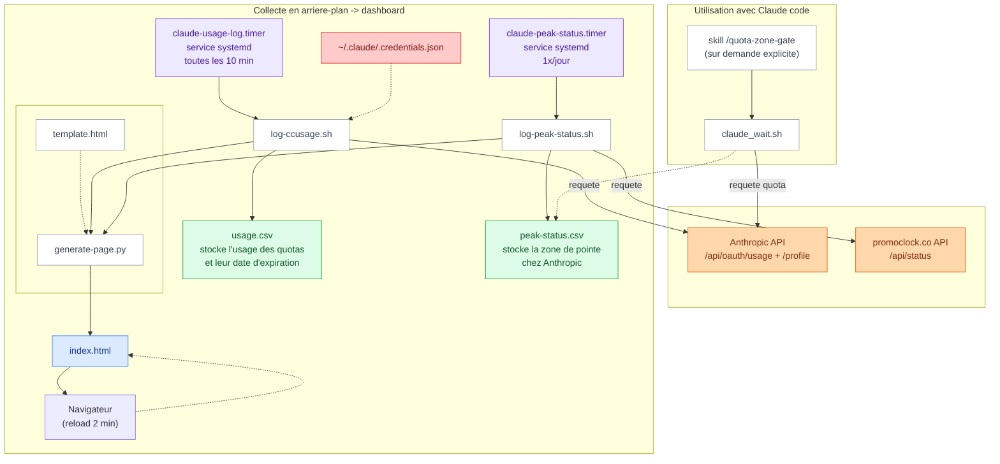

# monitoring-claude — implementation

Detail technique de comment c'est construit. Pour l'installation et
l'usage courant, voir [README.md](README.md).

## Recuperation des donnees

### Quota (session 5h / semaine 7j)

On utilise l'API Anthropic pour recuperer le quota actuel et les
periodes de quota (dates de reset) :

```
GET https://api.anthropic.com/api/oauth/usage
GET https://api.anthropic.com/api/oauth/profile   (palier d'abonnement)
```

Avec le token OAuth deja stocke localement par Claude Code
(`~/.claude/.credentials.json`) - lecture seule, aucun cout en token
modele. Ces appels sont regroupes dans `bin/lib-anthropic.sh`, source par
les scripts qui en ont besoin ; le token est transmis a `curl` par son
entree standard, jamais en argument (il n'apparait donc pas dans `ps`).

### Heures de pointe / creuses

Anthropic ralentit la vitesse de traitement pendant les heures de forte
demande (heures de pointe). [promoclock.co](https://promoclock.co/fr)
suit ce planning et l'expose via une API publique, sans authentification :

```
GET https://promoclock.co/api/status
```

### Encapsulation

Ces deux appels sont encapsules dans des scripts dedies plutot
qu'appeles en vrac :

- `bin/log-ccusage.sh` : appelle l'API quota, ajoute une ligne a
  `usage.csv`, tourne toutes les 10 min via un timer systemd.
- `bin/log-peak-status.sh` : appelle l'API promoclock (le seul appelant
  de cette API dans tout le projet), ajoute une ligne a `peak-status.csv`,
  tourne 1x/jour via un autre timer systemd - c'est volontairement la
  seule requete quotidienne vers ce service benevole tiers.
- `bin/claude_wait.sh` : appelle l'API quota Anthropic **en direct** a la
  demande, mais **pas** l'API promoclock - le statut heures de pointe est
  recalcule localement (planning fixe, voir plus bas) et la vitesse
  affichee ("normal"/"reduced") vient du dernier snapshot dans
  `peak-status.csv`.

## Visualisation

`www/index.html` est un dashboard statique (canvas + JS, sans librairie
externe) qui affiche l'historique collecte : 2 graphes (quota 5h sur 24h,
quota 7j sur 3 semaines), chacun avec une zone standard/alerte et, pour
le quota 5h, le hachurage des heures de pointe.

### Zone standard, zone alerte et zone de pointe

**Zone de pacing (session/semaine)** : seuil lineaire de 30% en debut de
periode a 90% en fin de periode (proportionnel au temps ecoule). Au-dessus
de la ligne = zone alerte (fond rouge sur le graphe), en dessous = zone
standard (fond vert). Si l'usage depasse 90%, le seuil ne le rattrapera
jamais avant la fin de la periode : le retour n'arrive qu'au prochain
reset.

**Sortie de zone alerte** : quand l'usage actuel est en zone alerte, un
segment horizontal rouge en pointilles le prolonge, a partir de la
derniere mesure, jusqu'au point ou la ligne de pacing le rattrape, avec
l'heure de sortie (et le jour sur le graphe 7j). Ce calcul suppose qu'il
n'y a plus de consommation d'ici la : chaque point de % consomme en plus
repousse la sortie de 5 min sur la session 5h, et de 2h48 sur la semaine 7j
(la ligne monte de 60 points sur la periode). Pour la meme raison,
l'arrondi des % a l'entier renvoye par l'API rend cette heure approximative.

**Changement d'abonnement** : les pourcentages renvoyes par l'API sont
relatifs au quota du plan en cours - un 60% en Pro et un 60% en Max 5x ne
representent pas la meme consommation absolue. Chaque ligne de `usage.csv`
embarque donc le palier (`rate_limit_tier`) en vigueur au moment de la
mesure, et le dashboard **coupe la courbe** a chaque changement de palier,
avec un trait vertical et le libelle du changement (`Pro -> Max 5x`) :
sans ca, la chute des % au moment du changement se lirait comme un reset.
Le palier courant est aussi affiche dans les cartes du haut et par
`claude_wait.sh`. Les lignes anterieures a l'ajout de cette colonne ont un
palier vide (`inconnu`) et ne declenchent aucun marqueur.

**Plafond Fable** : sur Max (et les sieges Premium), les modeles Fable ont
leur propre plafond hebdomadaire a l'interieur du quota 7j (50% de la
limite hebdo). L'API le renvoie dans `limits[]` comme une entree
`weekly_scoped` dont `scope.model.display_name` vaut `Fable` - il n'existe
pas d'equivalent sur la session 5h. Son % est relatif a ce plafond, pas au
quota 7j global : il peut atteindre 100% alors que le quota 7j est a 60%.
Il est trace en orange sur le graphe 7j et a sa propre carte, en zone
alerte selon la meme ligne de pacing que la semaine (appliquee a son
propre %). Dans `claude_wait.sh`, il ne bloque que les taches lancees avec
`--fable` : une tache sur Opus/Sonnet ne consomme pas ce plafond. Colonnes
vides quand non mesure ou absent du plan.

**Zone de pointe** : jours ouvrables 13h-19h UTC (15h-21h a Paris en
ete), jamais le week-end - hachuree sur le graphe quota 5h. Planning
donne en clair par l'API promoclock, mais code en dur cote client pour ce
hachurage (et dans `claude_wait.sh`, voir "Limites connues" plus bas pour
la nuance).

## Generation de la page statique

A chaque execution reussie de `log-ccusage.sh` (~10 min) ou
`log-peak-status.sh` (1x/jour), le script appelle
`bin/generate-page.py`, qui lit `usage.csv`, lit le gabarit
`www/template.html`, et embarque directement le contenu du CSV dans le
HTML (comme une chaine JS), puis ecrit `www/index.html`. Le fichier
resultant est donc statique et autonome - toutes les donnees sont deja
dedans, pas d'appel reseau au chargement.

Independamment de ca, si tu laisses la page ouverte dans un navigateur,
elle se recharge elle-meme (`location.reload()`) toutes les **2 min**
pour relire la derniere version ecrite sur disque - ce qui est different
de la cadence de collecte reelle (~10 min). Concretement : la donnee
affichee peut avoir jusqu'a ~10 min, mais tu ne verras jamais un ecart de
plus de 2 min entre "une nouvelle donnee est arrivee" et "elle s'affiche
a l'ecran".

## Script de verification (claude_wait.sh)

`bin/claude_wait.sh` interroge l'API quota Anthropic en direct (session
5h + semaine 7j), et calcule le statut heures de pointe **localement**
(voir "Limites connues" plus bas) plutot que d'appeler promoclock.co - il
lit juste la vitesse ("normal"/"reduced") dans le dernier snapshot de
`peak-status.csv`, en pur affichage. Il donne une recommandation texte
prete a l'emploi. C'est ce script que le skill `quota-zone-gate` appelle
une fois active ; il peut aussi etre lance a la main :

```bash
./bin/claude_wait.sh            # tache sur Opus/Sonnet : le plafond Fable ne bloque pas
./bin/claude_wait.sh --fable    # tache sur Fable : le plafond Fable bloque comme la semaine
```

```
Session (5h)  : 82% - zone ALERTE - retour en zone standard dans 47min (vers 11:32) - reprise a 11:35 (+2min)
Semaine (7j)  : 60% - zone ALERTE - retour en zone standard dans 36h56 (vers 01/08 22:00) - reprise a 01/08 22:11 (+10min)
Fable (7j)    : 20% - deja en zone STANDARD.
Heures creuses : NON (heures de pointe en cours) - retour en heures creuses dans 20min (vers 11:05).

=> Tache non urgente : ATTENDRE 37h06 (jusqu'a 01/08 22:11) - session en zone alerte + semaine en zone alerte + heures de pointe.
=> Reprise : 2026-08-01T22:11+02:00 - cron "11 22 1 8 *" - delai 133560 s
```

L'heure de reprise est l'heure de sortie de zone alerte plus une marge :
+2 min pour la session 5h, +10 min pour la semaine 7j et le plafond Fable.
Elle est arrondie a la minute superieure et jamais placee pile sur :00 ou
:30, car un reveil cron one-shot a ces minutes peut partir jusqu'a 90 s en
avance. La recommandation combinee prend la plus tardive des heures de
reprise bloquantes. La ligne `=> Reprise`, presente seulement en cas
d'attente, donne cette heure sous forme exploitable (ISO local, cron,
delai en secondes) : c'est elle que le skill utilise pour programmer son
reveil.

Il reimplemente en Python le meme calcul de zone de pacing que le
dashboard (en JS) - les deux utilisent la meme formule (seuil 30%→90%)
pour rester coherents.

## Skill Claude Code : quota-zone-gate

`skills/quota-zone-gate/SKILL.md` (symlinke dans `~/.claude/skills/` par
`install.sh`) fait de `claude_wait.sh` un garde-fou **volontaire**. Il
l'appelle par le lien `~/.local/bin/claude_wait.sh`, pose lui aussi par
`install.sh` : le skill ne depend donc pas de l'emplacement du depot.
le skill ne se declenche que sur demande explicite de l'utilisateur
(voir sa `description` en frontmatter, qui pilote le declenchement cote
Claude Code) - jamais de sa propre initiative avant une tache non
urgente/lourde. Une fois active pour une tache **non urgente** ou
**lourde** (gros lot de forks paralleles, boucle longue...), l'agent
verifie la recommandation du script, et si elle indique d'attendre,
programme un reveil unique a l'heure de reprise (`CronCreate` one-shot,
avec `ScheduleWakeup` en repli) au lieu de lancer la tache tout de suite.
Pas de reveils intermediaires : chaque reveil est un tour de modele qui
consomme lui-meme du quota. Les taches urgentes ne sont jamais bloquees.

## Structure du depot

```
monitoring-claude/
├── install.sh                  installe les 2 timers systemd, le skill et le lien claude_wait.sh
├── update.sh                   git pull --ff-only puis install.sh
├── uninstall.sh                desinstalle tout ca, demande (ou --purge) pour les donnees
├── LICENSE                     MIT
├── bin/
│   ├── lib-anthropic.sh          fonctions communes d'appel aux API de compte Anthropic
│   ├── log-ccusage.sh            logue usage 5h/7j/Fable + regenere la page (systemd, ~10 min)
│   ├── log-peak-status.sh        logue le statut peak/off-peak + regenere la page (systemd, 1x/jour)
│   ├── generate-page.py          regenere www/index.html a partir des CSV
│   └── claude_wait.sh            verification combinee + recommandation
├── systemd/
│   ├── claude-usage-log.service.template   / .timer   (toutes les 10 min)
│   └── claude-peak-status.service.template / .timer   (1x/jour, 06:00)
├── skills/
│   └── quota-zone-gate/SKILL.md  skill Claude Code (symlinke par install.sh dans ~/.claude/skills/)
├── docs/
│   └── screenshots/              captures du README.md (donnees fictives) + generer-captures.py
└── www/
    ├── template.html            gabarit statique (CSS + JS de rendu)
    └── index.html               page generee - c'est celle-ci qu'on ouvre
```

## Liste des composants

| Composant | Emplacement une fois installe | Role | Periodicite |
|---|---|---|---|
| `claude-usage-log.timer` | `~/.config/systemd/user/` (genere depuis `systemd/claude-usage-log.service.template` par `install.sh`) | Declenche `log-ccusage.sh` | Toutes les 10 min (`OnCalendar=*:0/10`) |
| `bin/log-ccusage.sh` | dans ce depot | Lit le token OAuth de Claude Code, interroge les API usage + profile Anthropic, ajoute une ligne a `usage.csv`, appelle `generate-page.py`. Skip silencieusement si token absent/expire ou appel usage en echec (un echec sur le profile laisse juste le palier vide) | A chaque declenchement du timer ci-dessus |
| `usage.csv` | `~/.config/monitoring-claude/` | Historique append-only des mesures 5h/7j/Fable + palier d'abonnement associe | Une nouvelle ligne a chaque execution reussie de `log-ccusage.sh` |
| `claude-peak-status.timer` | `~/.config/systemd/user/` (depuis `systemd/claude-peak-status.service.template`) | Declenche `log-peak-status.sh` | 1x/jour a 06:00 (`OnCalendar=*-*-* 06:00:00`) |
| `bin/log-peak-status.sh` | dans ce depot | Interroge promoclock.co, ajoute une ligne a `peak-status.csv`, appelle `generate-page.py` | A chaque declenchement du timer ci-dessus |
| `peak-status.csv` | `~/.config/monitoring-claude/` | Historique du statut peak/off-peak | Une nouvelle ligne par jour |
| `bin/generate-page.py` | dans ce depot | Lit `usage.csv` + `www/template.html`, embarque les donnees dans le HTML, ecrit `www/index.html` (`peak-status.csv` n'est pas encore utilise par le dashboard) | A chaque fois que `log-ccusage.sh` ou `log-peak-status.sh` reussit (+ appel manuel possible) |
| `www/template.html` | dans ce depot | Gabarit HTML/CSS/JS du dashboard (source editee a la main) | Statique - ne change que quand on modifie l'affichage |
| `www/index.html` | dans ce depot | Page generee, statique et autonome (donnees deja embarquees, aucun appel reseau au chargement) | Reecrite a chaque log reussi |
| Navigateur (page ouverte par l'utilisateur) | poste local | Parse les donnees embarquees, dessine les graphes, se recharge lui-meme | Auto-reload toutes les 2 min |
| `bin/claude_wait.sh` | dans ce depot, lien `~/.local/bin/claude_wait.sh` (par `install.sh`) | Interroge l'API quota Anthropic **en direct** ; pour les heures de pointe, calcule localement (planning fixe) et lit juste la vitesse dans `peak-status.csv` - n'appelle jamais promoclock.co | A la demande, aucun timer |
| `skills/quota-zone-gate/SKILL.md` | symlink dans `~/.claude/skills/` (par `install.sh`) | Appelle `claude_wait.sh` avant une tache non urgente/lourde et bloque/reprogramme si besoin | A chaque fois qu'un agent Claude Code envisage une tache non urgente/lourde |

## Diagramme des composants



## Details d'installation

Le depot est l'installation : aucun fichier n'est copie, tout ce qui est
pose hors du depot pointe vers lui. Modifier un script ou le skill dans le
depot prend donc effet immediatement, sans reinstaller.

`install.sh` est idempotent (aucun `sudo` necessaire) :

1. Verifie les prerequis (`curl`, `jq`, `python3` >= 3.7, `systemctl`).
2. Cree `~/.config/monitoring-claude` si besoin.
3. Genere les 2 unites systemd user depuis `systemd/` avec le chemin du
   depot, puis active les timers (voir tableau des composants).
4. Pose deux liens symboliques : `~/.claude/skills/quota-zone-gate` vers
   `skills/quota-zone-gate/`, et `~/.local/bin/claude_wait.sh` vers
   `bin/claude_wait.sh`. Si un fichier ou dossier reel porte deja l'un de
   ces noms, il s'arrete sans rien ecraser.
5. Genere `www/index.html`.

`update.sh` fait un `git pull --ff-only` (si une branche distante est
suivie) puis relance `install.sh`. Les CSV existants sont mis a niveau
(colonnes ajoutees, laissees vides sur l'historique) au prochain releve.

`uninstall.sh` desactive et supprime les unites systemd, supprime les
deux liens s'ils pointent bien vers ce depot, puis propose de supprimer
les donnees (`--purge` pour le faire sans demander ; conservees sans
terminal interactif). Si le depot est deplace, relancer `install.sh`
depuis son nouvel emplacement suffit a tout repointer.

## Format des CSV

- `usage.csv` : `timestamp,session_usage,session_reset_at,weekly_usage,weekly_reset_at,rate_limit_tier,fable_usage,fable_reset_at`
- `peak-status.csv` : `timestamp,status,is_peak,is_off_peak,is_weekend,session_limit_speed,next_change,minutes_until_change`

Stockes dans `~/.config/monitoring-claude/` (hors de ce depot, pour
survivre a un `git clean`/reinstall).

## Debug / operations manuelles

```bash
./bin/log-ccusage.sh          # ajoute un point usage + regenere www/index.html
./bin/log-peak-status.sh      # ajoute un point peak-status + regenere www/index.html
tail -f ~/.config/monitoring-claude/usage.csv
tail -f ~/.config/monitoring-claude/peak-status.csv
./bin/generate-page.py        # regenere la page sans ajouter de point
```

## Limites connues

- `/api/oauth/usage` et `/api/oauth/profile` ne sont pas des API
  documentees par Anthropic : ce sont celles qu'utilise l'interface de
  quota, lues avec le token de Claude Code. Leur format peut changer sans
  preavis ; un champ absent donne une mesure sautee ou une colonne vide,
  pas une erreur bloquante.
- Le palier d'abonnement est lu sur `GET /api/oauth/profile`
  (`organization.rate_limit_tier`), pas dans
  `~/.claude/.credentials.json` : le `rateLimitTier` stocke localement
  reste fige sur l'ancienne valeur apres un changement d'abonnement
  (constate lors d'un passage Pro -> Max 5x, ou le fichier a bien ete
  reecrit a l'instant du changement mais en conservant l'ancien palier).
  Les libelles lisibles sont mappes a deux endroits
  (`www/template.html` et `bin/claude_wait.sh`) ; un palier inconnu du
  mapping s'affiche brut, sans rien casser.
- Le token OAuth utilise est celui de Claude Code
  (`~/.claude/.credentials.json`). Claude Code le rafraichit lui-meme
  pendant l'utilisation normale ; on ne reimplemente pas le flux de
  refresh OAuth ici. Si le token est expire au moment precis d'un appel
  (rare, seulement si Claude Code n'a pas tourne depuis longtemps),
  l'appel est simplement skip - inoffensif, le suivant reessaiera avec un
  token a jour.
- Les timers sont des services **user** systemd (`systemctl --user`) :
  ils ne tournent que pendant une session utilisateur active (ou pendant
  que la machine n'est ni eteinte ni en veille), sauf si le lingering est
  active (`loginctl enable-linger $USER`, necessite les droits admin). Un
  gros ecart entre deux points du CSV correspond le plus souvent a une
  mise en veille/extinction de la machine sur cette periode, pas a un bug
  du logger (voir l'indicateur "WARNING" devant "Last data" sur le dashboard).
- Le planning des heures de pointe (jours ouvrables 13h-19h UTC) est code
  en dur en **deux** endroits, comme regle fixe : `www/template.html`
  (hachurage du graphe Quota 5h) et `bin/claude_wait.sh` (calcul local du
  statut, voir plus haut - fait expres pour ne pas solliciter
  promoclock.co a chaque verification). L'API promoclock elle-meme note
  "No known end date for peak hours adjustment" - si Anthropic change ce
  planning, il faudra mettre a jour la regle aux deux endroits. Seul
  `log-peak-status.sh` interroge encore promoclock.co en direct (1x/jour,
  pour l'historique du dashboard) et resterait donc a jour tout seul si le
  planning change.
