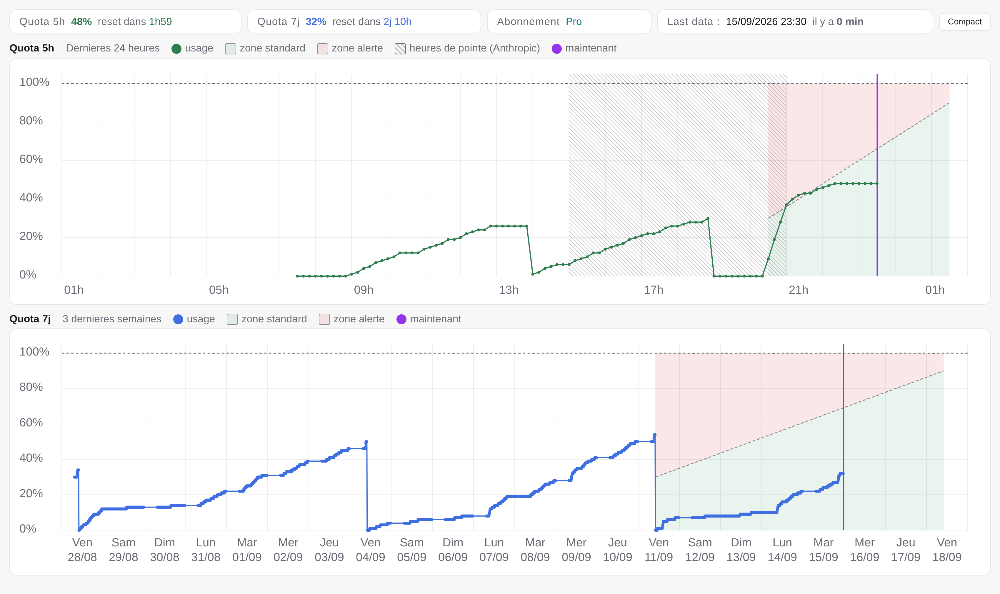
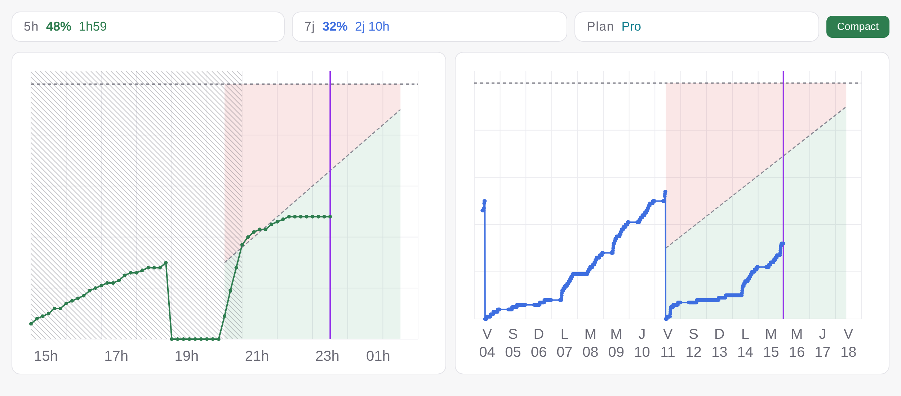
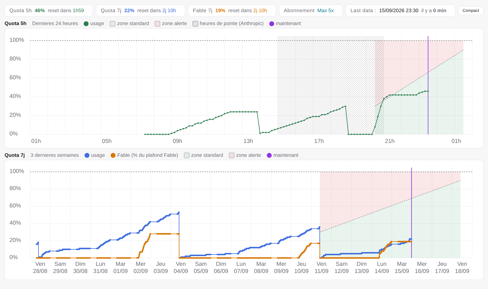
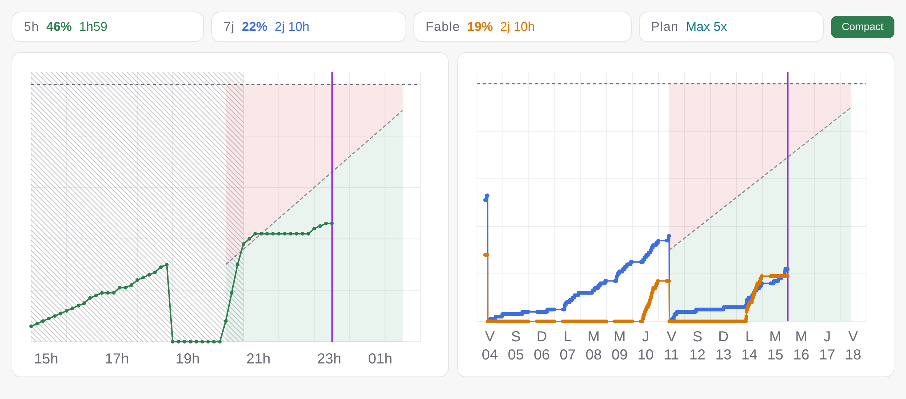

# monitoring-claude

Affiche l'usage du quota Claude Code (session 5h / semaine 7j, et le
plafond hebdomadaire propre aux modeles Fable) dans la duree, pour savoir d'un coup d'oeil si on a de la marge ou pas. S'integre
a un skill Claude Code (a activer volontairement) qui sert de garde-fou
avant de lancer une tache **non urgente** en tache de fond (gros lot de
forks, boucle longue...), pour eviter de se retrouver sans quota au
moment ou une tache vraiment importante/urgente en aurait besoin.

> Prevu pour un usage avec un **abonnement Claude Pro (ou Max)** utilise
> via **Claude Code** - c'est ce plan d'abonnement qui a des quotas
> 5h/7j a suivre. Pas concerne si tu utilises une cle API facturee a
> l'usage.

<table align="center" width="100%">
<tr>
  <th></th>
  <th align="center" width="48%">Vue Standard</th>
  <th align="center" width="48%">Vue Compact</th>
</tr>
<tr>
  <th>Pro</th>
  <td align="center"><a href="docs/screenshots/dashboard-pro-normal.png"></a></td>
  <td align="center"><a href="docs/screenshots/dashboard-pro-compact.png"></a></td>
</tr>
<tr>
  <th>Max 5x</th>
  <td align="center"><a href="docs/screenshots/dashboard-max5x-normal.png"></a></td>
  <td align="center"><a href="docs/screenshots/dashboard-max5x-compact.png"></a></td>
</tr>
</table>

## Prerequis

- Linux avec systemd (timers utilisateur `systemctl --user`)
- `bash`, `curl`, `jq`, `python3` (>= 3.7)
- Claude Code connecte avec un abonnement (le token OAuth qu'il stocke
  dans `~/.claude/.credentials.json` sert a lire le quota)

## Installation

```bash
git clone https://github.com/xavinsky/monitoring-claude.git
cd monitoring-claude
./install.sh
```

Installe les timers de collecte, genere le dashboard, et installe le
skill Claude Code. Le depot est l'installation : rien n'est copie
ailleurs, `install.sh` pose seulement des liens symboliques et des unites
systemd qui pointent vers le depot - ne pas le supprimer ni le deplacer
sans relancer `./install.sh` (ou desinstaller d'abord).

## Mise a jour

```bash
./update.sh
```

Fait un `git pull --ff-only` puis relance `./install.sh`.

Un souci a l'installation ou apres (timer qui ne tourne pas, "WARNING"
devant "Last data" sur le dashboard...) ? Voir
[troubleshooting.md](troubleshooting.md).

## Desinstallation

```bash
./uninstall.sh
# ou
./uninstall.sh --purge    # supprime aussi les donnees collectees
```

## Usage

### 1. Dans Claude Code

Une fois installe, le skill `quota-zone-gate` est disponible dans toutes
tes conversations Claude Code, mais **ne se declenche que si tu le
demandes explicitement** - jamais tout seul. Par exemple :

```
─────────────────────────────────────────────────────────────────────────────────
❯ utilise /quota-zone-gate pour la tache non urgente suivante : ...
─────────────────────────────────────────────────────────────────────────────────
```

(ou en langage naturel : "check le quota avant de lancer ça", "attends
la zone verte"...). Si tu l'actives pour une tache **non urgente** ou
**lourde** (gros lot de forks paralleles, boucle longue...) et que le
quota est trop juste, il decale la tache au lieu de la lancer tout de
suite. Les taches urgentes ne sont jamais bloquees.

### 2. Visualiser le dashboard

Ouvre `www/index.html` dans un navigateur (double-clic, ou `xdg-open
www/index.html`) - aucun serveur necessaire, la page se recharge
elle-meme toutes les 2 minutes pour rester a jour (l'appel a l'API,
lui, n'est fait que toutes les 10 min par le timer - voir
[Installation](#installation)).

Voir [README.infra.md](README.infra.md#zone-standard-zone-alerte-et-zone-de-pointe)
pour le detail du calcul des zones affichees sur les graphes.

## Fonctionnalites et composants

- Collecte automatique en arriere-plan (2 timers systemd user, aucun
  cout en token) de l'usage 5h/7j, du plafond Fable 7j et du statut
  heures de pointe/creuses.
- Suivi du plan d'abonnement : les % sont relatifs au quota du plan, donc
  un passage Pro <-> Max coupe la courbe et affiche un marqueur plutot que
  de laisser croire a une chute de consommation.
- Dashboard statique et autonome (pas de serveur, donnees embarquees
  dans le HTML a chaque regeneration).
- Skill Claude Code (`/quota-zone-gate`, a activer volontairement) qui
  verifie le quota avant une tache non urgente/lourde et decale si
  besoin (le plafond Fable ne bloque que les taches Fable).
- Scripts d'installation, de mise a jour et de desinstallation
  idempotents (`uninstall.sh --purge` pour aussi supprimer les donnees
  collectees).

Detail de l'implementation (ou tourne chaque composant, ce qu'il fait,
diagramme du flux de donnees, format des CSV, limites connues) dans
[README.infra.md](README.infra.md).

## Licence

[MIT](LICENSE).
